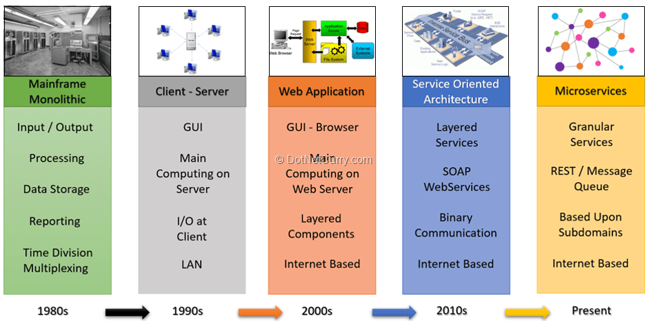
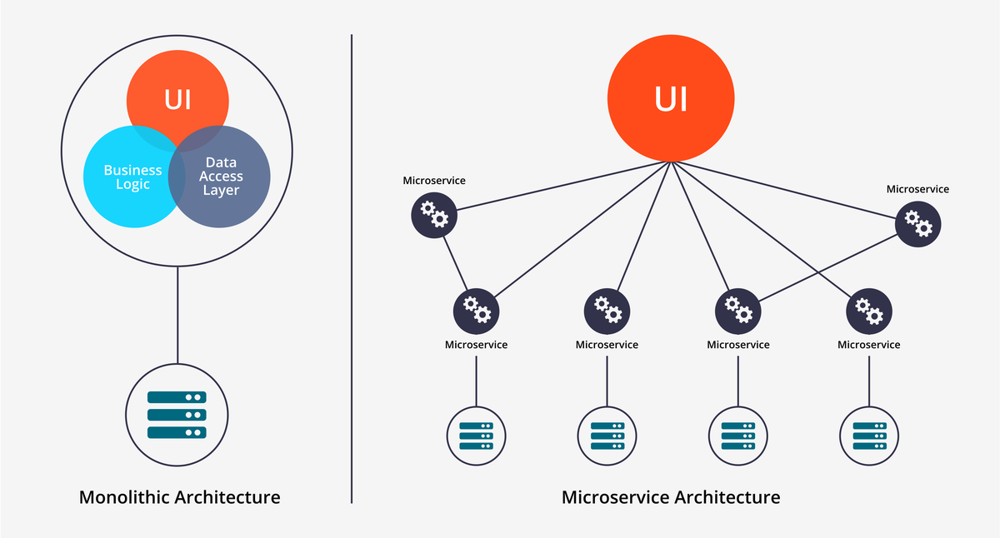
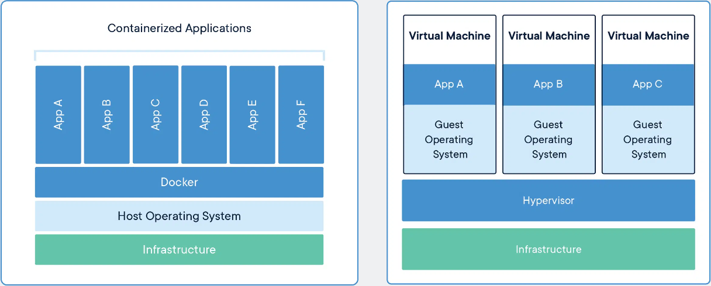

# Microservices


## FOR SHAHRUKH
`docker run -d -p 80:80 agelemerov/eng130-angel-docker:profile`




Microservices - also known as the microservice architecture - is an architectural style that structures an application as a collection of services that are:
- Highly maintainable and testable
- Loosely coupled
- Independently deployable
- Organized around business capabilities
- Owned by a small team
- The microservice architecture enables the rapid, frequent and reliable delivery of large, complex applications. It also enables an organization to evolve its technology stack.


### Benefits of Microservices

- Improved Scalability
- Better Fault Isolation for More Resilient Applications
- Programming Language and Technology Agnostic
- Better Data Security and Compliance
- Faster Time to Market and “Future-Proofing”
- Greater Business Agility and Support for DevOps
- Support for Two-Pizza Development Teams
## Docker
Docker is a platform designed to help developers build, share, and run modern applications. 

### What is a container?
A container is a standard unit of software that packages up code and all its dependencies so the application runs quickly and reliably from one computing environment to another.


### Benefits of Docker
The benefits of Docker in building and deploying applications are many:

- Caching a cluster of containers
- Flexible resource sharing
- Scalability - many containers can be placed in a single host
- Running your service on hardware that is much cheaper than standard servers
- Fast deployment, ease of creating new instances, and faster migrations.
- Ease of moving and maintaining your applications
- Better security, less access needed to work with the code running inside containers, and fewer software dependencies


## Docker setup

Docker Daemon
Docker Host
Docker Engine
All the same

1. Check connection - `docker pull hello-world` (case sensitive)
2. If you are getting an error similar to this:
```
Using default tag: latest
error during connect: In the default daemon configuration on Windows, the docker client must be run with elevated privileges to connect.: Post "http://%2F%2F.%2Fpipe%2Fdocker_engine/v1.24/images/create?fromImage=hello-world&tag=latest": open //./pipe/docker_engine: The system cannot find the file specified.
```

3. Make sure you are logged into docker `docker login`
4. Make sure you are running terminal in admin mode
5. If you have done both run the following command `alias docker="winpty docker"`
6. `docker run`
   
### Ghost
Testing microservice
- If you are getting this error:
  ```
    connect ECONNREFUSED 127.0.0.1:3306
    "Unknown database error"
  ```

To delete container:
- `docker rm CONTAINERID -f`

To run in detached mode:
`docker run -d -p 80:80 nginx`

To see logs
`docker logs CONTAINERID`


## Host nginx
- `docker run -d -p 80:80 nginx`
- `docker ps` copy name of container (at the end)
- `docker rename (name of container)`
- Go to dockerhub
- Create a repository
- Name it and create it

- In GitBash
- `docker tag nginx:latest agelemerov/eng130-angel-docker:profile`
- `docker push agelemerov/eng130-angel-docker:profile`

## To upload a file:
- `docker cp C:/Users/angel/Desktop/Microservices/images/resume.css  70b047cb03e3:/usr/share/nginx/html`


## Steps
1. Create dockerfile

```Dockerfile
  # docker run -d -p 80:80 nginx
  FROM nginx
  #who is creating it
  LABEL MAINTAINER=eng130-angel
  # created index.html profile -> copy to container
  # default location -> usr/share/nginx/html/
  COPY index.html /usr/share/nginx/html/
  # commit
  # push
  # docker run -d -p 80:80 name
  #       launch nginx
  #       port number must be specified
  EXPOSE 80

  #launch server
  CMD ["nginx", "-g", "daemon off;"]
```

2. Build an image
   1. `docker build -t agelemerov/eng130-angel-docker .` - where . is the Dockerfile locaiton
3. Commit changes
   1. `docker commit inspiring_diffie agelemerov/eng130-angel-docker:latest`
4. Push changes to DockerHub
   1. `docker push agelemerov/eng130-angel-docker:latest`
5. Run the image
   1. `docker run -d -p 80:80 agelemerov/eng130-angel-docker`

## Setup NodeApp in Docker container

1. Create new folder
2. Create new Dockerfile in folder
3. Add any file you want to that folder (in this case app and environment folders)
4. To the Dockerfile add the following script:

```Dockerfile
  FROM nginx

  LABEL MAINTAINER=eng130-angel

  COPY app /home/
  COPY environment /home/

  EXPOSE 80
  EXPOSE 3000

  RUN apt-get update
  RUN apt-get install -y
  RUN apt-get install software-properties-common -y
  RUN apt-get install npm -y

  CMD ["nginx", "-g", "daemon off;"]
  WORKDIR /home/app
  RUN npm install
  CMD ["npm", "start"]
```

5. Build the node app
   1. `docker build -t nodeapp .`
6. Run the app to make sure it works locally
   1. `docker run -d -p 80:3000 nodeapp`
7. Stop the container
   1. `docker stop ID`
8. Commit the changes we made to "node"
   1. `docker commit ID agelemerov/eng130-angel-docker:latest`
9. Push the changes
   1.  `docker push agelemerov/eng130-angel-docker:latest`
10. To check if all is good
    1.  Delete the image
        1.  `docker rm ID -f`
    2.  Run the image from DockerHub
        1.  `docker run -d -p 80:3000 agelemerov/eng130-angel-docker:latest`
11. If you now go to "localhost" in your browser, you should see your app